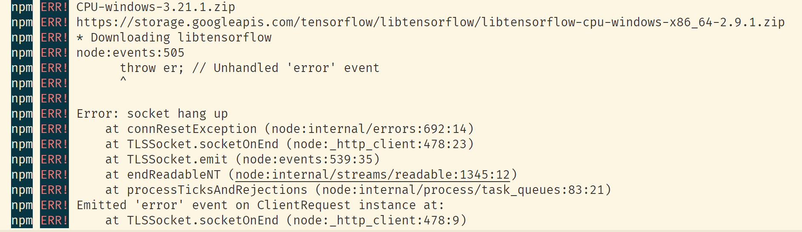

> nsfwjs-api 鉴别 jpg、png、gif图片

### 🏠 [Homepage](https://github.com/kongxiangyiren/nsfwjs-api#readme)

## Install

```sh
npm i nsfwjs-api
```

# Err

## 1、安装报错



在项目根目录下创建 `.npmrc` 文件

```bash
TFJS_NODE_CDN_STORAGE=https://cdn.npmmirror.com/binaries/
```

或者

```bash
npm config set TFJS_NODE_CDN_STORAGE https://cdn.npmmirror.com/binaries/
```

## Use

### js

```javascript
//commonjs
// const nsfwjsApi = require( 'nsfwjs-api') 

// module
import nsfwjsApi from 'nsfwjs-api'; 


// 是否使用本地模型 默认false
nsfwjsApi.UseModel = true;

// 模型位置 默认运行文件夹下model, UseModel为false时无效
nsfwjsApi.model = './model/';

//   copy模型文件夹, UseModel为false时无效
// 模型文件 https://github.com/infinitered/nsfwjs/tree/master/example/nsfw_demo/public/model
nsfwjsApi.cpModel();

// gif配置
nsfwjsApi.gif = {
  // fps: 1, //每秒帧数，从中按比例选取帧（默认为所有帧）
  topk: 5 // 每帧返回的结果数（默认全部为 5）
};

// 鉴图
//  图片地址 可以是 https | http | 图片路径
// 图片类型 为 jpg | png | gif
nsfwjsApi
  .identificationOfPictures('./QQ截图20221116221527.gif')
  .then(result => {
    // 成功
    if (result.code === 200) {
      console.log(result.msg);
    } else {
      // 失败
      console.log(result.msg);
    }
  })
  .catch(err => {
    console.log(err);
  });
```

### ts

```typescript
import nsfwjsApi from 'nsfwjs-api';

// 是否使用本地模型 默认false
nsfwjsApi.UseModel = true;

// 模型位置 默认运行文件夹下model, UseModel为false时无效
nsfwjsApi.model = './model/';

//   copy模型文件夹, UseModel为false时无效 
// 模型文件 https://github.com/infinitered/nsfwjs/tree/master/example/nsfw_demo/public/model
nsfwjsApi.cpModel();

// gif配置
nsfwjsApi.gif = {
  // fps: 1, //每秒帧数，从中按比例选取帧（默认为所有帧）
  topk: 5 // 每帧返回的结果数（默认全部为 5）
};

// 鉴图
//  图片地址 可以是 https | http | 图片路径
nsfwjsApi
  .identificationOfPictures('./QQ截图20221116221527.gif')
  .then(result => {
    // 成功
    if (result.code === 200) {
      console.log(result.msg);
    } else {
      // 失败
      console.log(result.msg);
    }
  })
  .catch(err => {
    console.log(err);
  });
```

## Author

👤 **空巷一人**

* Github: [@kongxiangyiren](https://github.com/kongxiangyiren)

## 🤝 Contributing

Contributions, issues and feature requests are welcome!Feel free to check [issues page](https://github.com/kongxiangyiren/nsfwjs-api/issues). You can also take a look at the [contributing guide](https://github.com/kongxiangyiren/nsfwjs-api/blob/master/CONTRIBUTING.md).

## Show your support

Give a ⭐️ if this project helped you!

## 📝 License

Copyright © 2022 [空巷一人](https://github.com/kongxiangyiren).
This project is [MIT](https://github.com/kongxiangyiren/nsfwjs-api/blob/master/LICENSE) licensed.

***

*This README was generated with ❤️ by *[*readme-md-generator*](https://github.com/kefranabg/readme-md-generator)